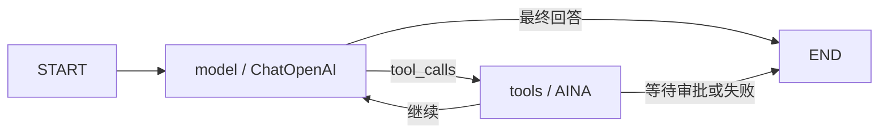

# Unibot 运行时框架边界

## 已采用的框架

| 运行时边界 | 框架 | 项目保留的代码 |
| --- | --- | --- |
| Agent Loop | LangGraph `StateGraph` | AINA 路由、审批、Trace、Widget 聚合等产品语义 |
| 模型调用 | LangChain `ChatOpenAI` / `bind_tools` | 动态模型配置和统一 `LLMClient` 端口 |
| 定时触发 | APScheduler `AsyncIOScheduler` | 从业务仓库读取任务、记录执行历史 |
| Cron 语义 | croniter | 时区选择和任务字段校验 |
| 多节点互斥 | redis-py `Lock` | 锁命名空间和节点执行记录 |
| 远程 Agent 互操作 | 官方 A2A Python SDK | AINA 安装权限、Canvas/Widget 和 Trace 映射 |

框架负责通用机制，AINA 代码只保留 Unibot 自身的产品语义。现有 FastAPI、Pydantic、SQLAlchemy、Redis、React 和 Vite 边界保持不变。

## Agent Loop

`AgentRuntime` 使用 LangGraph 构建有界状态图：



模型节点通过 LangChain 的 `ChatOpenAI` 调用 OpenAI Chat Completions 兼容服务，并通过 `bind_tools` 使用统一工具调用格式。LangGraph 负责循环和终止边，项目代码继续负责最大迭代次数、审批恢复、Trace 以及 AINA Widget。

## 分布式定时任务

每个 Unibot 节点运行一个 APScheduler 异步调度器。APScheduler 驱动到期任务扫描，croniter 计算标准五段 crontab 的下一次执行时间。节点执行某次任务前必须取得 redis-py 的分布式锁；锁使用随机所有权令牌并在任务运行期间自动续租，因此只有锁持有节点可以释放锁，长任务也不会因为租约过期而被重复执行。

MySQL 中的 AINA 任务和执行历史仍是业务事实来源。这个设计没有共享 APScheduler 3.x JobStore，因为 APScheduler 3.x 官方不保证多个调度器共享同一个 JobStore 时的安全性；跨节点唯一执行由 Redis 锁明确保证。

## AINA、A2A 与 MCP

- A2A 复用范围：Agent Card、远程 Agent 发现、消息发送、任务状态、Artifact 和流式更新。
- MCP 适用范围：工具、资源和 Prompt 的发现及调用。它适合后续替换通用 Tool HTTP 接口，但不能表达完整 AINA App。
- AINA 保留范围：安装与授权、Canvas 路由、`main_widget`、宿主 Widget、Unibot Trace 和内置 AINA。

远程 AINA 的 `runtime.protocol` 支持：

- `aina`：兼容现有 AINA 1.0 的 `/describe`、`/health`、`/invoke`。
- `a2a`：通过官方 A2A SDK 读取 `/.well-known/agent-card.json` 并发送 `SendMessage`；A2A Artifact/Message 会映射为 AINA Output。

注册 A2A Agent 时仍使用 AINA Manifest 包装 Unibot 专有 UI 和安装信息：

```json
{
  "protocol_version": "1.0",
  "aina": {
    "id": "com.example.report",
    "name": "Report Agent",
    "version": "1.0.0",
    "description": "Generate reports",
    "publisher": {"id": "example", "name": "Example"}
  },
  "runtime": {
    "type": "remote",
    "protocol": "a2a",
    "endpoint": "https://agent.example.com",
    "streaming": true
  }
}
```
