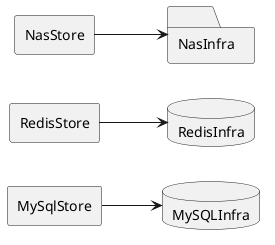

# Storage Abstraction Layer - Design

## Overview

This design keeps the storage abstraction layer intentionally small. The Aina layer will use three singleton stores:

- `MySqlStore` for database CRUD operations.
- `RedisStore` for cache CRUD operations.
- `NasStore` for NAS/file CRUD operations.

Each store hides the concrete storage client and exposes a stable Aina-facing contract. Distributed-system behavior such as replication, clustering, high availability, consistency, and scaling remains the responsibility of MySQL, Redis, and NAS infrastructure.

Initial scope:

- Provide one application-runtime singleton for MySQL.
- Provide one application-runtime singleton for Redis.
- Provide one application-runtime singleton for NAS.
- Keep CRUD-like operations only.
- Do not add a router, facade, policy engine, cross-backend transaction layer, or distributed coordination layer.

Research basis:

- FastAPI lifespan supports startup and shutdown management for shared resources: [FastAPI Lifespan Events](https://fastapi.tiangolo.com/advanced/events/).
- SQLAlchemy 2.0 supports asyncio database access through `AsyncEngine` and `async_sessionmaker`: [SQLAlchemy asyncio](https://docs.sqlalchemy.org/en/20/orm/extensions/asyncio.html).
- SQLAlchemy supports the `mysql+aiomysql` async MySQL dialect: [SQLAlchemy MySQL aiomysql](https://docs.sqlalchemy.org/en/20/dialects/mysql.html#aiomysql).
- redis-py provides an async Redis client suitable for shared application use: [redis-py asyncio](https://redis.io/docs/latest/develop/clients/redis-py/async/).
- Python `pathlib` provides safe object-oriented filesystem path handling for a NAS root: [Python pathlib](https://docs.python.org/3/library/pathlib.html).

## Architecture

The architecture is a direct mapping from each store singleton to its backing infrastructure.



Runtime lifecycle:

1. Application startup loads storage settings.
2. Application startup creates `MySqlStore`, `RedisStore`, and `NasStore` once per process.
3. The three stores are attached to application state or dependency injection for Aina services.
4. Aina services call the stores directly through their abstraction interfaces.
5. Application shutdown closes Redis and MySQL resources. NAS does not require client shutdown because it is represented as a mounted filesystem path.

Suggested package layout:

```text
backend/src/tianzhou_agent_platform/store/
  __init__.py
  settings.py
  errors.py
  models.py
  database/
    __init__.py
    mysql.py
  redis/
    __init__.py
    client.py
  nas/
    __init__.py
    filesystem.py
```

Usage shape:

```python
mysql_store = request.app.state.mysql_store
redis_store = request.app.state.redis_store
nas_store = request.app.state.nas_store

await mysql_store.create(...)
await redis_store.set(...)
await nas_store.write(...)
```

The Aina layer should not construct SQLAlchemy engines, Redis clients, or direct filesystem access paths.

## Components and Interfaces

### StorageSettings

Loads the minimum configuration needed by the three singleton stores.

Responsibilities:

- Read MySQL connection settings.
- Read Redis connection settings.
- Read NAS root path.
- Read simple operation limits such as cache TTL and NAS maximum file size.
- Redact credentials from logs and error messages.

### MySqlStore

The singleton MySQL abstraction.

Responsibilities:

- Own one SQLAlchemy `AsyncEngine`.
- Own one `async_sessionmaker`.
- Open sessions per operation.
- Expose approved database CRUD operations.
- Hide SQLAlchemy and MySQL details from Aina services.
- Convert database errors to storage-layer errors.

Initial interface:

```python
class MySqlStore:
    async def create(self, resource: str, values: dict[str, object]) -> StoreRecord: ...
    async def read(self, resource: str, record_id: str | int) -> StoreRecord | None: ...
    async def update(self, resource: str, record_id: str | int, values: dict[str, object]) -> StoreRecord: ...
    async def delete(self, resource: str, record_id: str | int) -> DeleteResult: ...
    async def query(self, resource: str, query: StoreQuery) -> StorePage: ...
    async def close(self) -> None: ...
```

Design notes:

- `resource` is a logical resource name mapped by implementation, not an unrestricted raw SQL table name.
- Aina services must not pass raw SQL through this layer.
- Single-operation database transactions are handled inside each method where needed.
- MySQL replication, failover, consistency, and scaling are provided by the MySQL infrastructure.

### RedisStore

The singleton Redis cache abstraction.

Responsibilities:

- Own one `redis.asyncio.Redis` client.
- Expose key/value CRUD operations.
- Apply simple namespace and TTL validation.
- Serialize and deserialize values.
- Hide Redis client details from Aina services.
- Convert Redis errors to storage-layer errors.

Initial interface:

```python
class RedisStore:
    async def get(self, namespace: str, key: str) -> CacheEntry | None: ...
    async def set(self, namespace: str, key: str, value: object, ttl_seconds: int | None = None) -> WriteResult: ...
    async def delete(self, namespace: str, key: str) -> DeleteResult: ...
    async def exists(self, namespace: str, key: str) -> bool: ...
    async def expire(self, namespace: str, key: str, ttl_seconds: int) -> WriteResult: ...
    async def close(self) -> None: ...
```

Design notes:

- Cache keys are generated by the store from `namespace` and `key`.
- Aina services should not construct raw Redis keys.
- Redis clustering, replication, eviction, and persistence behavior are provided by Redis infrastructure.

### NasStore

The singleton NAS/file abstraction.

Responsibilities:

- Own one configured NAS root path.
- Resolve all file paths relative to that root.
- Expose file CRUD operations.
- Reject path traversal outside the root.
- Hide platform-specific filesystem details from Aina services.
- Convert filesystem errors to storage-layer errors.

Initial interface:

```python
class NasStore:
    async def write(self, path: StoragePath, content: bytes, overwrite: bool = True) -> FileMetadata: ...
    async def read(self, path: StoragePath) -> bytes: ...
    async def delete(self, path: StoragePath) -> DeleteResult: ...
    async def exists(self, path: StoragePath) -> bool: ...
    async def metadata(self, path: StoragePath) -> FileMetadata: ...
```

Design notes:

- `StoragePath.relative_path` must remain inside the configured NAS root.
- Absolute paths from Aina services are not accepted.
- NAS durability, availability, replication, and mount behavior are provided by NAS infrastructure.

## Data Models

The models are intentionally small and backend-neutral.

### Settings

```python
class StorageSettings(BaseSettings):
    mysql_dsn: SecretStr
    mysql_pool_size: int = 5
    mysql_max_overflow: int = 10
    mysql_timeout_seconds: float = 5.0

    redis_dsn: SecretStr
    redis_timeout_seconds: float = 2.0
    redis_default_ttl_seconds: int | None = None

    nas_root_path: Path
    nas_max_file_size_bytes: int = 100 * 1024 * 1024
```

### Shared Results

```python
class DeleteResult(BaseModel):
    deleted: bool

class WriteResult(BaseModel):
    written: bool
```

### MySQL Models

```python
class StoreRecord(BaseModel):
    resource: str
    id: str | int
    values: dict[str, object]

class StoreQuery(BaseModel):
    filters: dict[str, object] = Field(default_factory=dict)
    contains_filters: dict[str, str] = Field(default_factory=dict)
    limit: int = 100
    offset: int = 0

class StorePage(BaseModel):
    items: list[StoreRecord]
    limit: int
    offset: int
```

### Redis Models

```python
class CacheEntry(BaseModel):
    namespace: str
    key: str
    value: object
    ttl_seconds: int | None = None
```

### NAS Models

```python
class StoragePath(BaseModel):
    relative_path: str

class FileMetadata(BaseModel):
    path: StoragePath
    size_bytes: int
    modified_at: datetime | None = None
    content_type: str | None = None
```

### Error Model

```python
class StorageErrorCode(str, Enum):
    NOT_FOUND = "not_found"
    VALIDATION_FAILURE = "validation_failure"
    POLICY_VIOLATION = "policy_violation"
    TIMEOUT = "timeout"
    BACKEND_UNAVAILABLE = "backend_unavailable"
    UNSUPPORTED_CAPABILITY = "unsupported_capability"
    UNKNOWN_BACKEND_FAILURE = "unknown_backend_failure"

class StorageError(Exception):
    code: StorageErrorCode
    message: str
```

## Error Handling

Each store maps backend-specific exceptions to storage-layer errors before returning control to Aina services.

General rules:

- Missing records, keys, or files return `None` for read-like methods that allow absence.
- Missing records, keys, or files return `NOT_FOUND` for operations that require existence.
- Invalid resource names, keys, TTL values, paths, or payloads return `VALIDATION_FAILURE`.
- File size or path-scope violations return `POLICY_VIOLATION`.
- Operation timeouts return `TIMEOUT`.
- Connection or mount availability failures return `BACKEND_UNAVAILABLE`.
- Disabled or unimplemented operations return `UNSUPPORTED_CAPABILITY`.
- Unexpected backend failures return `UNKNOWN_BACKEND_FAILURE`.

Backend-specific mapping:

| Store | Backend condition | Storage-layer result |
| --- | --- | --- |
| `MySqlStore` | Connection acquisition fails | `BACKEND_UNAVAILABLE` |
| `MySqlStore` | Query or command times out | `TIMEOUT` |
| `MySqlStore` | Requested row is absent | `None` or `NOT_FOUND` by method contract |
| `RedisStore` | Redis connection fails | `BACKEND_UNAVAILABLE` |
| `RedisStore` | Key is absent | `None` or `False` by method contract |
| `RedisStore` | Invalid TTL | `VALIDATION_FAILURE` |
| `NasStore` | File is absent | `None`, `False`, or `NOT_FOUND` by method contract |
| `NasStore` | Path escapes NAS root | `POLICY_VIOLATION` |
| `NasStore` | NAS mount is inaccessible | `BACKEND_UNAVAILABLE` |

Sensitive data handling:

- Do not log MySQL DSNs, Redis DSNs, credentials, Redis values, SQL parameters, file contents, or absolute NAS paths when those paths are sensitive.
- Error messages returned to Aina should be safe and storage-layer-specific.
- Backend exception details may be logged only after sanitization.

Retry behavior:

- The initial design does not require automatic retries.
- If retries are later added, read-like operations may be retried only when safe.
- Write-like operations should not be retried unless the method contract guarantees idempotency or the storage infrastructure provides safe retry semantics.

## Testing Strategy

### Unit Tests

Unit tests should cover the store logic without real infrastructure:

- `StorageSettings` validation for MySQL DSN, Redis DSN, NAS root path, and limits.
- `MySqlStore` method behavior using a fake session factory.
- `RedisStore` method behavior using a fake Redis client.
- `NasStore` path normalization and root-bound validation.
- Error mapping for representative MySQL, Redis, and filesystem exceptions.
- Secret and payload redaction in logs and errors.

### Contract Tests

Each singleton store should have contract tests for its public interface:

- `MySqlStore`: create, read, update, delete, query, not-found behavior, and close behavior.
- `RedisStore`: get, set, delete, exists, expire, cache miss behavior, TTL validation, and close behavior.
- `NasStore`: write, read, delete, exists, metadata, missing file behavior, and path traversal rejection.

### Integration Tests

Integration tests should use real or containerized infrastructure when available:

- MySQL test database through SQLAlchemy async engine.
- Redis test instance through the async Redis client.
- Temporary directory or test NAS mount for `NasStore`.

The integration suite should verify that:

- The application creates one `MySqlStore`, one `RedisStore`, and one `NasStore` per process.
- MySQL and Redis resources close cleanly at shutdown.
- NAS file operations stay inside the configured root.
- Aina-facing tests can replace each store with a fake implementation.

### Migration Checks

Migration checks should keep Aina code behind the abstraction:

- New Aina code should not directly import SQLAlchemy engine/session objects for storage access.
- New Aina code should not directly import Redis client objects for storage access.
- New Aina code should not directly access NAS paths for storage access.
- Any direct backend access that remains should be documented as an approved exception.
