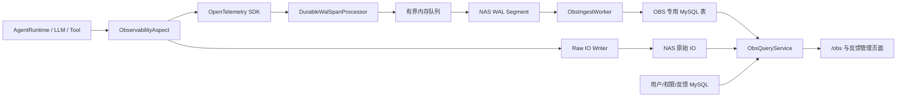

# IR-01 OpenTelemetry SDK + WAL 可靠存储技术设计

## 1. 文档说明

### 1.1 文档目的

本文档定义 Unibot 可观测性数据从“业务请求同步写 MySQL”迁移为“OpenTelemetry SDK 采集、NAS WAL 持久化、后台批量写 MySQL”的技术方案。

本方案仅引入代码和数据库表结构变更，不新增 OpenTelemetry Collector、Phoenix、ClickHouse、Kafka 等独立服务，并继续使用项目已有的 MySQL、Redis 和 NAS。

本文档重点回答：

1. 如何降低 Trace、Span、模型调用和原始 IO 对对话主链路的影响。
2. 如何避免纯内存异步队列在进程退出或 MySQL 故障时丢失数据。
3. 如何使用 WAL、幂等写入和故障恢复保证已完成交互的数据可靠性。
4. 如何调整数据模型和查询接口以支持当前 `/obs` 页面、用户权限和反馈回溯。
5. 如何分阶段迁移、验证和回滚。

### 1.2 设计结论

本方案采用以下决策：

- 使用 OpenTelemetry Python SDK 作为 Trace/Span 的应用内数据模型和上下文标准。
- 不部署 OpenTelemetry Collector，不使用 OTLP 作为本期数据传输链路。
- 在 Unibot Backend 内实现专用的 WAL Writer 和 MySQL Ingest Worker。
- Span 完成后形成不可变记录，先写入 NAS WAL，再由后台 Worker 批量写入 MySQL。
- 一轮交互对应一个 OTel Trace，一个对话对应一个 Session。
- 已完成交互在返回用户前必须完成 WAL `fsync`，但不等待 MySQL。
- Trace、Span 和 Event 使用规范化表，不再把整个 Trace 作为单条 JSON 反复重写。
- 完整模型/工具 IO 经过脱敏后存 NAS；Span 表仅保存可读摘要、聚合字段和文件地址。
- 反馈、用户、权限和对话继续属于业务数据，保留在现有 MySQL Repository 中。
- `/obs` 由后端按权限查询聚合结果，前端不再加载用户全部 Trace 和 LLM Call。

### 1.3 适用范围

本设计覆盖：

- Agent、模型、Tool、Skill、MCP、AINA 和内部处理 Span
- 用户输入、最终回复、Token、TTFT、时延、错误和上下文压缩数据
- 原始模型请求/响应和工具输入/输出
- WAL 写入、轮转、重放、幂等入库和积压处理
- 普通用户与管理员 OBS 查询权限
- 反馈上下文回溯和数据保留关联
- 单实例、多 Uvicorn Worker 和多 Backend 实例场景

### 1.4 非本期范围

- 部署 OpenTelemetry Collector 或第三方可观测性后端
- 跨企业、跨平台的完整分布式追踪
- 使用 OTel Logs 迁移所有应用日志
- 自动根因分析、自动修复和完整告警平台
- 使用 Kafka 等消息系统实现跨地域持久队列
- 对 Phoenix、ClickHouse、Tempo、Loki 等后端的选型和部署

## 2. 背景与现状问题

### 2.1 当前写入链路

当前 `ObservabilityAspect` 的方法虽然通过异常捕获避免可观测性异常中断业务，但每个方法仍然在业务协程中等待 Repository：

```text
AgentRuntime
  -> await ObservabilityAspect.start_span/finish_span/record_event
  -> await Repository 修改内存 TraceRecord
  -> await MySQL read
  -> await MySQL create/update
  -> await Redis set
```

当前持久化模型将完整的 `TraceRecord` 保存为一条 JSON。每新增一个 Event、Span 或 Span 状态变更，都会重新序列化并写回整个 Trace。

模型调用还会分别保存 `running` 和 `completed/failed` 状态。随着单轮交互中的 Span 和原始 IO 增长，写入次数、JSON 大小和锁持有时间持续增加。

### 2.2 主要问题

#### 2.2.1 业务请求等待 OBS 数据库

`observation_slice` 只能隔离异常，不能消除 `await` 带来的数据库延迟。MySQL 或 Redis 变慢时，对话请求同样会变慢。

#### 2.2.2 整条 Trace JSON 写放大

Trace 包含全部 Span、Event、输入、输出和属性。任何局部变化都会重写全部内容，写入复杂度随 Trace 大小增长。

#### 2.2.3 全局锁覆盖存储 I/O

Trace 修改在 Repository 全局锁内完成，数据库或 Redis 延迟会阻塞其他 Repository 操作。

#### 2.2.4 启动和查询成本随历史数据增长

持久化 Repository 启动时加载全部 Trace 和 LLM Call 到内存，并重新写入 Redis。前端个人总览还会分页加载全部 LLM Call，再在浏览器计算统计结果。

#### 2.2.5 原始日志并不完整

当前 `sanitize_trace_data()` 同时承担密钥脱敏和展示截断：字符串最多 4,000 字符、集合最多 50 项、嵌套最大 8 层。因此当前保存的所谓原始 IO 已经被截断。

#### 2.2.6 纯内存异步队列不可靠

如果只把同步写入改为 `asyncio.Queue`，进程崩溃、强制退出或机器断电会导致队列中尚未入库的数据丢失。

## 3. 设计目标与可靠性承诺

### 3.1 功能目标

- 支持现有 `/obs?sessionId=...` 对话总览、调用树、错误诊断和原始日志。
- 支持个人日/周/月 Token、活跃天数和 Token Calendar 聚合。
- 支持管理员按用户查询真实 OBS 数据。
- 支持错误从对话框、错误诊断跳转到精确的 Trace/Span 原始日志。
- 支持反馈管理员查看反馈时间点之前的上下文。

### 3.2 性能目标

- 对话主链路不执行 OBS MySQL 查询或写入。
- 对话主链路不执行 OBS Redis 写入。
- Span/Event 更新不再重写完整 Trace JSON。
- MySQL 正常时，完成交互后的 OBS 数据在 1 秒内可查询。
- OBS MySQL 使用独立小连接池，不耗尽业务连接池。
- 迁移完成后，Backend 启动不加载全部历史 Trace 和 LLM Call。

### 3.3 可靠性承诺

本方案提供以下可验证保证：

1. 对于已经向用户返回成功、失败或等待审批结果的交互，对应 Trace 终态记录已完成 WAL `fsync`。
2. MySQL 暂时不可用时，已持久化 WAL 不丢失，并在 MySQL 恢复后自动补写。
3. Backend 在 MySQL 提交后、WAL 删除前崩溃，重放不会产生重复 Span、Event 或 Token。
4. 原始 IO 地址只有在文件完成原子持久化后才允许进入 WAL 和数据库。
5. 进程异常退出后，能够恢复 WAL 中的完整 Frame，并忽略文件末尾未完成的 Frame。

### 3.4 明确不承诺的情况

- NAS 存储介质损坏或被外部删除。
- NAS 与 MySQL 同时长时间不可用。
- 有限磁盘空间面对无限期 MySQL 故障时仍然零丢失。
- 正在执行的交互在最后一次 WAL 周期刷新前遭遇机器断电时完全不丢失。

对于正在执行中的交互，WAL Writer 定期批量刷盘；异常断电最多损失最后一个尚未刷盘的片段。对于已经完成的交互，`finish_trace()` 必须等待 Trace Barrier，确保此前所有记录已落盘。

## 4. 总体架构



### 4.1 组件职责

| 组件 | 职责 |
| --- | --- |
| `ObservabilityAspect` | 保留现有调用接口，创建/结束 OTel Span，维护旧 ID 映射和 Trace Barrier |
| `DurableWalSpanProcessor` | 将结束后的 OTel Span 转为不可变 `ObsRecord` 并提交到 WAL 队列 |
| `RawIoWriter` | 脱敏、压缩、原子写入完整原始 IO |
| `WalWriter` | 单写者追加 Frame、批量 `fsync`、Segment 轮转和完成通知 |
| `WalRecovery` | 启动扫描、Frame 校验、残缺尾部处理和孤儿 Segment 认领 |
| `ObsIngestWorker` | 读取已持久化记录并批量幂等写入 MySQL |
| `ObservabilityStore` | 管理专用表、独立连接池和批量 UPSERT |
| `ObsQueryService` | 权限校验、服务端聚合和页面 DTO 组装 |

### 4.2 为什么保留 OpenTelemetry SDK

虽然本期不部署 Collector，但使用 OTel SDK 仍有以下价值：

- 统一 Trace、Span、SpanContext、SpanLink 和异常记录方式。
- 使用 W3C Trace Context 为远程调用传播 `traceparent`。
- 使用 GenAI 语义字段记录模型、Token、工具和对话属性。
- 将来增加 Collector 时只需替换或增加 Exporter，不需要重写 Agent 埋点。

本期 OTel SDK 是应用内库，WAL Writer 是 Unibot 自己的可靠落盘实现。

## 5. Trace 与 Span 模型

### 5.1 Trace 边界

- 一轮用户交互对应一个 OTel Trace。
- 一个对话对应一个 Session。
- `session.id` 和 `gen_ai.conversation.id` 保存 `conversation_id`。
- Root Span 表示一次 `invoke_agent`。
- 模型、工具、Skill、MCP、AINA 和上下文压缩作为 Root Span 的子孙 Span。

审批暂停属于本轮交互的终态，Root Span 以 `approval_required` 结束。用户稍后确认审批时创建新的 OTel Trace，通过 `SpanLink` 关联原 Trace，并保持相同 `session.id`。已经结束的 OTel Span 不允许重新打开。

### 5.2 ID 兼容

现有业务 ID 为：

```text
trace_<32 hex>
span_<32 hex>
```

OTel Trace ID 和 Span ID 使用标准格式。本期同时保存：

| 字段 | 用途 |
| --- | --- |
| OTel `trace_id` | 标准链路标识 |
| OTel `span_id` | 标准节点标识 |
| `unibot.trace_id` | 兼容现有错误、消息和反馈引用 |
| `unibot.span_id` | 兼容现有 Span 引用 |
| `session.id` | 对话 ID |

新旧数据并存期间，查询服务同时支持 OTel ID 和旧 ID。迁移稳定后，再决定是否让消息和反馈直接使用 OTel ID。

### 5.3 Span 类型映射

| Unibot 节点 | OTel Span | 主要属性 |
| --- | --- | --- |
| 一轮交互 | Root Agent Span | `gen_ai.operation.name=invoke_agent`、Session、用户、租户 |
| 模型调用 | Model Span | 模型、Provider、Token、TTFT、输出速率、原始 IO 地址 |
| Tool/Skill/MCP | Tool Span | 工具类型、工具名、调用 ID、结果摘要、原始 IO 地址 |
| AINA | Agent/Tool Span | AINA ID、版本、远端时延、结果摘要 |
| 上下文压缩 | Internal Span | 压缩前后 Token、保留轮次、压缩模型和结果 |
| 审批 | Span Event | 审批 ID、请求/确认/拒绝/取消状态 |
| 错误 | Span exception | 错误类型、来源、可重试性、原始日志地址 |

### 5.4 关键属性

采用 OTel/GenAI 属性和 `unibot.*` 扩展字段：

```text
service.name
service.instance.id
session.id
user.id
gen_ai.conversation.id
gen_ai.operation.name
gen_ai.request.model
gen_ai.response.model
gen_ai.usage.input_tokens
gen_ai.usage.output_tokens
gen_ai.usage.cache_read.input_tokens
unibot.tenant.id
unibot.trace_id
unibot.span_id
unibot.sequence_no
unibot.gen_ai.ttft_ms
unibot.context.window_tokens
unibot.context.compression_count
unibot.raw_io.path
unibot.raw_io.sha256
unibot.raw_io.size_bytes
```

用户邮箱、Authorization、Cookie、模型密钥和其他凭证不得写入 Span、WAL 或原始 IO。

### 5.5 Span 状态

Unibot 页面状态与 OTel 状态的映射：

| Unibot 状态 | OTel 状态 | 扩展属性 |
| --- | --- | --- |
| `running` | UNSET | `unibot.status=running` |
| `completed` | UNSET/OK | `unibot.status=completed` |
| `approval_required` | UNSET | `unibot.status=approval_required` |
| `failed` | ERROR | `unibot.status=failed` |
| `cancelled` | UNSET | `unibot.status=cancelled` |

发生异常时调用 `record_exception()` 并设置 OTel ERROR。用户可见错误信息必须脱敏，原始异常堆栈只进入受权限保护的原始日志。

## 6. 写入时序与 Trace Barrier

### 6.1 普通 Span

1. `start_span()` 创建 OTel Span Handle。
2. 业务执行模型或工具调用。
3. 原始 IO 先由 `RawIoWriter` 原子写入 NAS。
4. `finish_span()` 设置输出摘要、Token、时延、错误和原始 IO 地址。
5. Span `end()` 后，Processor 生成不可变 `span_finished` 记录。
6. 记录进入有界队列，由单一 WalWriter 批量追加。

普通子 Span 完成时不等待 MySQL，也不要求每个 Span 单独 `fsync`。

### 6.2 Trace 完成

1. 最终回复或失败结果已经形成。
2. `finish_trace()` 结束 Root Span并生成 `trace_finished`。
3. 获取该 Trace 对应的最后一个 WAL 序号。
4. 调用 `await wal_writer.flush_through(sequence_no)`。
5. WalWriter 将该序号之前的 Frame 全部写入并执行一次 `flush + fsync`。
6. Barrier 完成后，业务层才返回结果。

这样一轮交互只在终态等待一次持久化同步，而不是每个 Span 等待 MySQL。

### 6.3 运行中数据

OTel Span 通常在结束时导出。若页面需要查看运行中的 Trace，可以额外写入轻量的 `trace_started` 和 `span_started` 记录，但其中不得包含大 IO。

完成记录按相同 `trace_id/span_id` 幂等覆盖运行中状态。

### 6.4 进程异常中断

每条记录包含 `producer_instance_id`。Backend 启动恢复旧实例 WAL 时，如果发现某 Trace 只有开始记录而没有终态记录，则：

- 将 Trace 标记为 `failed`。
- 设置 `unibot.interruption.reason=process_restart`。
- 将最后一个有效 Frame 时间作为诊断时间，不伪造完整完成时延。
- 对应 Span 标记为被进程中断，而不是继续显示为永久 `running`。

## 7. WAL 设计

### 7.1 目录结构

```text
data/nas/observability/wal/
  <producer_instance_id>/
    000000000001.active
    000000000002.sealed
```

`producer_instance_id`：

```text
<node_id>-<process_id>-<startup_uuid>
```

每个进程只追加自己的 `.active` 文件，不允许多个进程同时写一个文件。

### 7.2 Segment 生命周期

```text
active -> sealed -> ingested -> delete
```

满足任意条件时轮转：

- Segment 达到 32 MiB。
- Segment 活跃时间达到 30 秒。
- 应用正常关闭。

轮转必须执行：

1. 刷新用户态缓冲。
2. `os.fsync(file_descriptor)`。
3. 原子重命名 `.active` 为 `.sealed`。
4. 必要时同步父目录元数据。

### 7.3 Frame 格式

每个 Frame 采用长度前缀和校验码：

```text
+------------------+------------------+----------------------+------------------+
| Magic / Version  | Payload Length   | UTF-8 JSON Payload   | CRC32            |
+------------------+------------------+----------------------+------------------+
```

Payload 至少包含：

```json
{
  "schema_version": 1,
  "record_id": "obsrec_uuid",
  "record_type": "span_finished",
  "producer_instance_id": "node-pid-uuid",
  "sequence_no": 1024,
  "occurred_at": "2026-08-06T12:00:00Z",
  "trace_id": "...",
  "span_id": "...",
  "payload": {}
}
```

恢复规则：

- Magic 或版本不支持：隔离 Segment并报警。
- Payload 长度越界：隔离 Segment并报警。
- 最后一个 Frame 不完整：截断到最后一个有效 Frame。
- 文件中间 CRC 失败：不得跳过后继续读取，隔离 Segment并报警。
- 重放同一个 Frame：由数据库主键和 UPSERT 保证幂等。

### 7.4 WAL Writer

WalWriter 必须满足：

- 单写者模型，避免文件锁竞争。
- 使用有界队列，避免 MySQL 故障导致进程内存无限增长。
- 多条记录合并为一次写入和 `fsync`。
- 为 `flush_through(sequence_no)` 提供可等待的完成通知。
- `fsync` 成功后才把记录发布给 Ingest Worker。
- WAL 写入失败时不得错误地通知 Barrier 成功。

### 7.5 队列满时的行为

为满足可靠性要求，队列满时不能静默丢弃：

1. 短暂等待 WalWriter 释放空间。
2. 超时后在调用线程执行受控的同步 WAL append。
3. NAS 不可用时尝试同步批量直写 MySQL。
4. NAS 和 MySQL 同时不可用时记录高优先级 `telemetry_gap`，并按“业务优先”策略继续对话。

最后一种情况无法保证 OBS 数据完整，必须对外暴露健康状态和运维告警，不能静默处理。

## 8. 原始 IO 设计

### 8.1 存储路径

```text
data/nas/observability/raw/
  <tenant_id>/
    <user_id>/
      <trace_id>/
        <span_id>.json.gz
```

路径组成只能使用经过校验的系统 ID，禁止使用模型或用户提供的文件名。

### 8.2 文件内容

模型调用示例：

```json
{
  "schema_version": 1,
  "kind": "model",
  "trace_id": "...",
  "span_id": "...",
  "request": {
    "model": "...",
    "messages": [
      {"role": "system", "content": "..."},
      {"role": "user", "content": "..."},
      {"role": "assistant", "tool_calls": []},
      {"role": "tool", "content": "..."}
    ],
    "tools": []
  },
  "response": {},
  "usage": {},
  "error": null
}
```

工具调用示例包含完整的工具输入、返回值、标准错误和结构化错误。

“完整”表示不因调用树 UI 展示限制而截断，但仍然必须：

- 删除密钥、Token、Cookie、Authorization 和密码。
- 对二进制内容保存类型、大小、摘要和受控文件引用，不直接嵌入。
- 遵守 NAS 单文件最大大小限制。
- 超过单文件限制时明确记录 `raw_io_status=too_large`，不得伪装成完整数据。

### 8.3 原子写入顺序

```text
脱敏 -> JSON -> gzip -> 写临时文件 -> fsync -> 原子 rename -> WAL 写入文件引用
```

必须先完成文件持久化，再将 `raw_io_path` 写入 Span 记录。

崩溃后可能出现未被数据库引用的孤儿原始文件，但不允许出现数据库引用不存在文件的情况。孤儿文件由定期清理任务按文件年龄和数据库引用状态处理。

### 8.4 脱敏与摘要拆分

将当前单一函数拆分为两个职责：

```text
redact_trace_data(value)
  只做密钥和敏感信息脱敏，用于原始 IO

summarize_trace_data(value)
  先脱敏，再执行深度、数量和字符串长度限制，用于 Span 预览
```

任何数据必须在进入 WAL 前完成脱敏，不能依赖查询时脱敏，因为 WAL 本身也是持久化数据。

## 9. MySQL 数据模型

### 9.1 设计原则

- Trace、Span、Event 使用独立行，不保存不断增长的嵌套 Trace JSON。
- 高频筛选和聚合字段使用明确列，不依赖 JSON 全表扫描。
- 附加属性保留 JSON 列。
- 写入使用绝对值 UPSERT，禁止在重放时执行累加。
- 不对 Trace/Span 使用当前 Repository 的全局锁。
- 不把 OBS 数据写入 Redis Repository Cache。
- 初期不增加外键，允许重放期间 Span 和 Trace 以任意批次顺序到达。

### 9.2 `unibot_obs_traces`

| 字段 | 类型建议 | 说明 |
| --- | --- | --- |
| `trace_id` | VARCHAR(64) PK | OTel Trace ID |
| `legacy_trace_id` | VARCHAR(64) UNIQUE NULL | 兼容旧 ID |
| `root_span_id` | VARCHAR(32) | Root Span |
| `session_id` | VARCHAR(160) | 对话 ID |
| `user_id` | VARCHAR(160) | 权限与聚合字段 |
| `tenant_id` | VARCHAR(160) | 权限字段 |
| `producer_instance_id` | VARCHAR(255) | 生产实例 |
| `status` | VARCHAR(32) | Trace 状态 |
| `started_at` | DATETIME(6) | 开始时间 |
| `completed_at` | DATETIME(6) NULL | 结束时间 |
| `duration_ms` | DOUBLE NULL | 总时延 |
| `input_tokens` | BIGINT | 输入 Token 绝对值 |
| `output_tokens` | BIGINT | 输出 Token 绝对值 |
| `cache_read_tokens` | BIGINT | 缓存读取 Token 绝对值 |
| `message_count` | INT | 消息数 |
| `compression_count` | INT | 上下文压缩次数 |
| `error_count` | INT | 错误数 |
| `attributes` | JSON | 低频扩展字段 |

索引：

```text
(tenant_id, user_id, started_at)
(tenant_id, session_id, started_at)
(status, started_at)
(legacy_trace_id)
```

### 9.3 `unibot_obs_spans`

| 字段 | 类型建议 | 说明 |
| --- | --- | --- |
| `span_id` | VARCHAR(32) PK | OTel Span ID |
| `legacy_span_id` | VARCHAR(64) UNIQUE NULL | 兼容旧 ID |
| `trace_id` | VARCHAR(64) | 所属 Trace |
| `parent_span_id` | VARCHAR(32) NULL | 父 Span |
| `sequence_no` | BIGINT | 同 Trace 展示顺序 |
| `session_id` | VARCHAR(160) | 对话 ID |
| `user_id` | VARCHAR(160) | 权限字段 |
| `tenant_id` | VARCHAR(160) | 权限字段 |
| `kind` | VARCHAR(32) | agent/model/tool/aina/internal |
| `name` | VARCHAR(255) | Span 名称 |
| `target_id` | VARCHAR(255) NULL | 模型、工具或能力 ID |
| `model` | VARCHAR(255) NULL | 模型名 |
| `status` | VARCHAR(32) | Span 状态 |
| `started_at` | DATETIME(6) | 开始时间 |
| `first_output_at` | DATETIME(6) NULL | 首输出时间 |
| `completed_at` | DATETIME(6) NULL | 结束时间 |
| `duration_ms` | DOUBLE NULL | 时延 |
| `ttft_ms` | DOUBLE NULL | 首 Token 时延 |
| `input_tokens` | BIGINT | 输入 Token |
| `output_tokens` | BIGINT | 输出 Token |
| `cache_read_tokens` | BIGINT | 缓存读取 Token |
| `input_preview` | TEXT NULL | Reader-friendly 输入摘要 |
| `output_preview` | TEXT NULL | Reader-friendly 输出摘要 |
| `attributes` | JSON | 扩展属性 |
| `error` | JSON NULL | 脱敏错误 |
| `raw_io_path` | VARCHAR(1024) NULL | 原始 IO 地址 |
| `raw_io_sha256` | CHAR(64) NULL | 内容摘要 |
| `raw_io_size_bytes` | BIGINT NULL | 压缩后大小 |
| `raw_io_status` | VARCHAR(32) | ready/failed/too_large/not_applicable |

索引：

```text
(trace_id, sequence_no)
(trace_id, parent_span_id)
(tenant_id, user_id, started_at)
(tenant_id, session_id, started_at)
(kind, model, started_at)
(status, started_at)
(legacy_span_id)
```

### 9.4 `unibot_obs_events`

| 字段 | 类型建议 | 说明 |
| --- | --- | --- |
| `event_id` | VARCHAR(64) PK | 幂等 ID |
| `trace_id` | VARCHAR(64) | Trace ID |
| `span_id` | VARCHAR(32) NULL | 关联 Span |
| `session_id` | VARCHAR(160) | 对话 ID |
| `user_id` | VARCHAR(160) | 权限字段 |
| `tenant_id` | VARCHAR(160) | 权限字段 |
| `name` | VARCHAR(255) | Event 名称 |
| `status` | VARCHAR(32) NULL | 业务状态 |
| `occurred_at` | DATETIME(6) | 发生时间 |
| `attributes` | JSON | 扩展属性 |

保留真正的时间点事件，例如审批、首 Token、压缩完成和错误诊断。模型和工具调用已经由 Span 表达，不再额外保存重复的 started/completed Event。

### 9.5 不创建增量统计表

第一阶段个人总览直接从带索引的 Trace/Model Span 聚合，不创建每日 Token 增量计数表。

原因是 WAL 重放可能重复执行，使用 `total = total + value` 容易导致重复计数。待数据量证明现有索引无法满足查询目标后，再设计基于幂等明细重算或有消费位点的聚合表。

## 10. 幂等入库与 WAL 清理

### 10.1 批量 UPSERT

`ObservabilityStore` 使用专用 SQLAlchemy Core 批量语句：

```text
INSERT ... VALUES (...), (...), (...)
ON DUPLICATE KEY UPDATE
  status = VALUES(status),
  completed_at = VALUES(completed_at),
  input_tokens = VALUES(input_tokens),
  output_tokens = VALUES(output_tokens),
  ...
```

所有统计字段保存绝对值。禁止：

```text
input_tokens = input_tokens + VALUES(input_tokens)
```

否则同一 Segment 重放会造成 Token 翻倍。

### 10.2 数据库事务

每个批次在一个事务中完成：

1. UPSERT Trace。
2. UPSERT Span。
3. UPSERT Event。
4. 提交事务。
5. 通知 WAL Segment 消费进度。

不使用数据库外键，因此允许不同记录在不同批次到达；查询层只展示当前已存在的数据。

### 10.3 Segment 删除

采用 Segment 级确认，不维护每条 Frame 的永久 checkpoint：

1. 完整读取一个 `.sealed` Segment。
2. 校验全部 Frame。
3. 分批幂等写入数据库。
4. 全部事务提交成功。
5. 删除 Segment。

如果第 4、5 步之间崩溃，下次重放整个 Segment，UPSERT 保证结果不重复。

`.active` 文件在正常运行中可以通过内存 Offset 增量消费。进程重启后从头重放，允许重复但不允许遗漏。

## 11. 数据库连接隔离

现有 MySQL Store 的 `create()` 和 `update()` 会在写入后重新读取记录，并与业务 Repository 共用连接池，不适合 OBS 批量写入。

新增 `ObservabilityStore`：

- 使用相同 MySQL DSN。
- 使用独立连接池，初始建议 `pool_size=2`、`max_overflow=2`。
- 只提供 `create_tables`、`bulk_upsert` 和 OBS 查询方法。
- 不执行写后 SELECT。
- 不接入 Redis Write-through Cache。
- 不使用通用 Repository `_lock`。

独立连接池只能隔离应用连接竞争，不能隔离同一 MySQL 实例的磁盘和 CPU 竞争，因此批量大小、查询索引和数据保留仍需监控。

## 12. 查询与权限设计

### 12.1 查询原则

- 所有用户访问都经过 Unibot Backend。
- 前端不得直接访问 WAL、NAS 或 OBS 数据库。
- 普通用户查询必须同时包含 `tenant_id` 和 `user_id`。
- 管理员查询由 `require_platform_admin` 授权后才允许去掉用户条件。
- 原始 IO 权限必须先查询 Span 所属用户，不能只根据文件路径读取。
- 所有列表接口使用时间范围和游标/分页，禁止无界返回。

### 12.2 面向页面的接口

建议用页面所需 DTO 代替返回全部底层记录：

```text
GET /obs/overview?range=day|week|month
GET /obs/sessions/{session_id}
GET /obs/sessions/{session_id}/turns
GET /obs/raw-logs?trace_id=...&span_id=...
GET /admin/obs/overview?user_id=...
GET /admin/obs/sessions/{session_id}?user_id=...
```

对话详情响应直接包含：

- Token 总量、输入、输出、缓存读取
- 总 Token/s、输出 Token/s、TTFT、平均耗时
- 轮次和消息数
- 上下文容量、已用 Token、压缩次数
- Reader-friendly Span 调用树
- 错误诊断和原始日志定位 ID

个人总览响应直接包含：

- 时间范围汇总
- 分模型 Token 和调用量
- 活跃天数
- 每日 Token Calendar 数据

### 12.3 查询一致性

WAL 已持久化和 MySQL 可查询之间存在短暂最终一致性窗口。目标：MySQL 正常时不超过 1 秒。

前端进入 `/obs?sessionId=...` 后允许进行一次短间隔刷新。不得为了“立即显示”重新让对话响应等待 OBS MySQL 写入。

### 12.4 反馈上下文

Feedback 继续保存在业务 MySQL，记录：

```text
conversation_id
message_id
trace_id
feedback_created_at
```

反馈详情查询条件：

```text
session_id = feedback.conversation_id
started_at <= feedback.created_at
```

后续 Trace 不得进入反馈上下文。

为了避免默认保留期到期后无法回溯，负反馈创建时应保存上下文 Trace ID Manifest，并为关联 Trace/原始 IO 设置反馈保留标记，或生成一次只读上下文快照。具体保留时长由数据治理策略确定。

## 13. 多实例与远程调用

### 13.1 多进程写入

- 每个进程使用独立 `producer_instance_id` 和 WAL 目录。
- 不共享 `.active` 文件。
- MySQL 以 Trace/Span/Event 主键幂等合并。
- 当前实例只删除自己已经完整入库的 Segment。

### 13.2 孤儿 Segment 认领

Backend 启动后扫描非当前实例目录。认领恢复任务时优先使用现有 Redis 创建短期租约：

```text
obs-wal-replay:<segment-path>
```

Redis 只负责避免多个实例同时重放，不保存任何唯一数据。租约丢失最多导致重复重放，不会导致数据错误。

如果 Redis 不可用，可以依赖同一 NAS 内的原子 rename 认领 Segment。数据库幂等仍是最终正确性保障。

### 13.3 远程 AINA/MCP

本期至少在 Unibot Gateway 侧创建完整的远程调用 Span，并向支持 W3C Trace Context 的远端请求注入 `traceparent` 和 `tracestate`。

若远程服务尚未接入 OTel，调用树只展示 Unibot 观察到的远程请求时延、状态和结果。远程服务内部 Span 的回传需要额外的受认证遥测接收端点或 Collector，不属于本期纯代码可靠存储范围。

不得通过 OTel Baggage 向不可信远端传播用户邮箱、密钥或完整权限信息。用户与租户归属以 Unibot Root Span 和经过认证的业务请求为准。

## 14. 故障处理与降级

| 故障 | 处理方式 | 数据结果 |
| --- | --- | --- |
| MySQL 暂时不可用 | WAL 持续积累，指数退避重试 | 已 fsync 数据不丢 |
| Backend 崩溃 | 重启扫描、校验并重放 WAL | 完整 Frame 恢复 |
| WAL 尾部半写 | 截断到最后有效 Frame | 最后半条不生效 |
| WAL 中部损坏 | 隔离 Segment并报警 | 不静默跳过 |
| MySQL 提交后崩溃 | 重放同一 Segment | UPSERT 不重复 |
| 原始 IO 临时文件残留 | 定期清理孤儿 `.tmp` | 不产生无效引用 |
| NAS 不可用、MySQL正常 | 同步直写 OBS MySQL | 延迟上升但尽量保留 |
| MySQL 不可用、NAS正常 | 仅写 WAL | 查询延迟但不丢 |
| NAS和MySQL同时不可用 | 记录 `telemetry_gap` 并按业务优先继续 | 无法保证完整 |
| WAL 空间接近上限 | 告警、加速重试、尝试直写 MySQL | 需要运维介入 |

### 14.1 空间水位

建议提供以下水位：

- 70%：Warning，提示 WAL 积压。
- 85%：Critical，提示预计可用时间并提高重试频率。
- 95%：尝试绕过 WAL 直接写 MySQL；限制非关键调试副本，不得伪造完整原始 IO。
- 100%：记录 `telemetry_gap`，按业务优先策略继续对话。

“数据绝不丢失、业务永不阻塞、存储空间有限”三个目标无法同时满足。本设计选择在极端双存储故障时保证对话业务可用，但必须显式暴露数据缺口。

## 15. 自身可观测性

可靠存储链路本身至少暴露：

```text
obs_queue_depth
obs_queue_capacity
obs_wal_bytes
obs_wal_segment_count
obs_wal_oldest_age_seconds
obs_wal_fsync_duration_ms
obs_ingest_batch_size
obs_ingest_duration_ms
obs_ingest_last_success_at
obs_ingest_retry_count
obs_corrupt_segment_count
obs_raw_io_write_failure_count
obs_telemetry_gap_count
```

这些状态可以先通过结构化应用日志和管理员健康接口输出，不要求本期再建设一套监控平台。

必须禁止 OBS Writer 对自己的 WAL、MySQL 和日志操作再次产生需要持久化的 OBS Span，否则会形成递归采集。Worker 内应使用 OTel instrumentation suppression，或使用明确不被自动埋点的专用数据库客户端。

## 16. 生命周期设计

### 16.1 启动顺序

1. 验证 NAS 根目录存在并可写。
2. 创建 OBS 专用表。
3. 初始化本实例 WAL 目录和 Active Segment。
4. 启动 WalWriter。
5. 启动 ObsIngestWorker。
6. 扫描并认领历史孤儿 Segment。
7. 后台重放积压。
8. 初始化 OTel TracerProvider 和 Processor。
9. 开始接受新的 Agent 请求。

历史积压可以后台重放，不需要阻塞应用启动；但 WalWriter 必须在接受对话前可用。

### 16.2 正常关闭顺序

1. 停止接收新的 OBS 记录。
2. 结束或标记当前仍运行的 Trace。
3. 将内存队列全部追加到 WAL。
4. `fsync` 并 seal 当前 Segment。
5. 在关闭超时内尝试完成 MySQL 入库。
6. 未入库数据留在 WAL，等待下次启动恢复。
7. 停止 Ingest Worker 和 WalWriter。
8. 最后关闭 OBS 和业务数据库连接池。

不得先关闭 `StorageStores` 再等待后台任务，否则 Worker 会在关闭阶段持续失败。

## 17. 代码结构与变更范围

### 17.1 新增模块

```text
backend/src/tianzhou_agent_platform/core/telemetry.py
    OTel TracerProvider、Span 属性和状态映射

backend/src/tianzhou_agent_platform/core/observability_writer.py
    有界队列、Trace Barrier、Writer/Worker 协调

backend/src/tianzhou_agent_platform/store/observability_wal.py
    WAL Frame、Segment、append、fsync、恢复和轮转

backend/src/tianzhou_agent_platform/store/observability_store.py
    OBS 表、独立连接池、批量 UPSERT 和查询

backend/src/tianzhou_agent_platform/core/observability_query.py
    权限感知的页面聚合查询
```

### 17.2 修改模块

| 文件 | 变更 |
| --- | --- |
| `core/observability.py` | 保留接口，内部改为 OTel Span + Writer |
| `core/trace_details.py` | 拆分完整脱敏和展示摘要 |
| `core/llm.py` | LLMCall 不再单独同步写 Repository，改为补充 Model Span |
| `main.py` | 初始化和关闭 OTel、WAL、Ingest Worker、OBS Store |
| `api/operations.py` | 增加面向 OBS 页面的权限聚合接口 |
| `api/feedback.py` | 从新查询服务读取截止反馈时间的上下文 |
| `frontend/src/lib/obsData.ts` | 删除加载全部个人 LLM Call 的逻辑 |
| OBS 页面组件 | 改用后端聚合 DTO，视觉结构保持不变 |

### 17.3 不应继续使用的旧路径

迁移完成后：

- 不再通过 `PersistentRepository._save_record()` 保存 Trace/LLMCall。
- 不再把 Trace 和 LLMCall 写入 Redis Repository Cache。
- 不再在 Backend 启动时加载全部 Trace 和 LLMCall。
- 不再让前端循环分页加载全部 LLMCall。
- 不再为每个模型调用保存独立且重复的 LLMCall JSON 与 Model Span JSON。

## 18. 配置建议

本期只保留完成可靠存储所需的少量配置：

```text
UNIBOT_OBS_ENABLED=true
UNIBOT_OBS_WAL_ROOT=<nas-root>/observability/wal
UNIBOT_OBS_WAL_MAX_BYTES=<按部署容量设置>
UNIBOT_OBS_RAW_ROOT=<nas-root>/observability/raw
UNIBOT_OBS_RETENTION_DAYS=<数据治理确认>
```

批量大小、轮转大小和刷新间隔先使用代码内常量，只有压测证明不同部署确实需要调整时再配置化，避免过早引入大量参数。

## 19. 迁移方案

### 阶段一：基础设施代码

- 新建 OBS 规范化表。
- 实现批量幂等 UPSERT。
- 实现 WAL Frame、Segment、CRC、`fsync` 和恢复。
- 实现原始 IO 原子写入。

验证：WAL 单元测试、MySQL 幂等测试和崩溃恢复测试通过。

### 阶段二：双写对账

- 保留现有 Trace/LLMCall 写入。
- 同时写入 OTel + WAL 新链路。
- 对同一 Trace 比较 Span 数、Token、错误、时延和原始 IO。
- 双写仅用于迁移验证，不作为长期模式。

验证：连续一段真实流量中新旧数据口径一致，差异有明确解释。

### 阶段三：查询切换

- 新增 `ObsQueryService`。
- `/obs`、管理员 OBS 和反馈上下文改读新表。
- 前端停止全量加载 Trace/LLMCall。
- 老数据通过旧查询回退或一次性迁移脚本读取。

验证：普通用户、管理员、错误跳转和反馈回溯 E2E 通过。

### 阶段四：停止旧写入

- 停止 Trace/LLMCall 通过通用 Repository 写 MySQL 和 Redis。
- 停止启动时加载全部 Trace/LLMCall。
- 保留旧表只读一段回滚观察期。

验证：业务 P95、数据库 QPS、连接池占用和 OBS 完整性达到目标。

### 阶段五：清理

- 删除迁移期双写逻辑和临时开关。
- 根据数据保留策略归档或删除旧 JSON Trace/LLMCall 表。
- 补充运维手册、容量计算和故障演练记录。

## 20. 回滚方案

- 双写阶段可以立即将 `/obs` 查询切回旧表。
- 新链路异常时停止 Ingest Worker，不删除 WAL，待修复后重放。
- 停止旧写入前不得删除旧表。
- 数据库 Schema 采用新增表，不修改业务表，回滚不会影响对话和反馈业务。
- 新版本回滚到旧版本前，必须先 seal 当前 WAL；旧版本不消费 WAL，但文件保留供恢复版本继续处理。

## 21. 测试与验收

### 21.1 WAL 单元测试

- Frame 编解码和 CRC 校验。
- 最后一条 Frame 半写恢复。
- Segment 中部损坏隔离。
- Segment 轮转和原子 rename。
- `flush_through()` 只在 `fsync` 成功后完成。
- 多 Trace 并发写入顺序正确。
- 队列满时不静默丢弃。

### 21.2 入库测试

- 同一 Segment 重放两次，Trace/Span/Event 数量不增加。
- Token、错误数和压缩次数不翻倍。
- MySQL 事务失败后完整重试。
- 写入后不执行额外 SELECT。
- OBS 连接池耗尽不影响业务连接池。

### 21.3 故障恢复测试

- MySQL 停止 30 分钟后恢复，WAL 积压全部补写。
- Root Trace 完成并 `fsync` 后、MySQL 提交前强制结束进程，重启后数据完整。
- MySQL 提交后、Segment 删除前强制结束进程，重启后无重复。
- 原始 IO 临时文件写入期间强制结束进程，数据库无无效引用。
- 多 Backend 实例同时启动时，同一孤儿 Segment 最终正确入库。

### 21.4 权限测试

- 普通用户不能通过猜测 Trace ID、Span ID 或原始日志路径读取他人数据。
- 普通用户只能聚合本人数据。
- 管理员可以查询全部用户并按用户名筛选。
- 未登录和非管理员用户无法访问管理接口。
- 反馈上下文不包含反馈发生后的 Trace。

### 21.5 UI 与数据口径测试

- 对话总览 Token、速率、轮次和上下文数据正确。
- 调用树默认按轮次收起，展开后顺序和父子关系正确。
- 模型和工具结果展示 Reader-friendly 摘要，不展示 JSON 噪声。
- 原始日志按 Role 展示完整脱敏 IO。
- 错误诊断能定位并跳转到精确 Span 原始日志。
- 个人总览日/周/月 Token、活跃天数和 Calendar 一致。

### 21.6 性能验收

- 对话热路径没有 OBS MySQL/Redis I/O。
- Span 数增加时，不出现整条 Trace JSON 写放大。
- MySQL 正常时，OBS 查询可见延迟 P95 小于 1 秒。
- 开启新链路后的对话 P95 延迟相对关闭 OBS 的增量由压测确认并控制在目标范围内。
- MySQL 故障期间 Backend 内存保持稳定，积压转移到有界 WAL。

## 22. 运维检查项

- NAS WAL 路径必须是持久卷，不得是容器临时文件系统。
- NAS 必须支持同文件系统原子 rename；生产前验证 `fsync` 语义。
- 定期检查 WAL 总大小、最老 Segment 和最后入库成功时间。
- 定期演练 MySQL 停止、Backend 强制退出和 WAL 重放。
- 定期执行原始 IO 保留和孤儿文件清理。
- 反馈关联数据应用单独保留策略，避免处理中的反馈丢失上下文。
- 数据库备份必须覆盖 OBS 明细表；WAL 只用于短期可靠传输，不替代长期备份。

## 23. 风险与后续演进

### 23.1 主要风险

- 自研 WAL、重放和积压监控增加维护成本。
- NAS/NFS 的 `fsync` 和 rename 语义需要真实环境验证。
- MySQL 在长期高数据量下不适合复杂 Trace 分析。
- 原始 IO 数据量、隐私和保留成本可能快速增长。
- OTel GenAI 语义规范仍在演进，需要通过 `schema_version` 和 `unibot.*` 字段隔离变化。

### 23.2 升级到标准 Collector 的边界

出现以下任一情况时，应重新评估部署 OTel Collector 和专用分析后端：

- WAL/重放代码成为高频故障来源。
- 单 MySQL 无法满足写入或聚合查询性能。
- 多集群、跨地域或大量远程 Agent 需要统一遥测入口。
- 需要标准尾部采样、路由、转换和多后端导出。
- 需要 Phoenix、ClickHouse、Tempo 等成熟 Trace 查询能力。

届时保留应用内 OTel 埋点，替换 `DurableWalSpanProcessor` 为 OTLP Exporter，并由 Collector 承担 WAL、批量、重试和转发；AgentRuntime 和 Span 语义无需重写。

## 24. 最终验收定义

本设计完成的判定条件：

1. 已完成交互在返回前完成 WAL 持久化，MySQL 不在对话热路径上。
2. MySQL 故障和 Backend 重启测试证明数据可以恢复且不会重复统计。
3. 原始 IO 使用原子写入，数据库不存在无效文件引用。
4. `/obs` 和反馈管理全部改为权限感知的服务端查询。
5. 普通用户、管理员和反馈上下文权限测试通过。
6. Backend 不再启动加载全部历史 Trace/LLMCall。
7. 前端不再加载用户全部 LLMCall 后自行聚合。
8. WAL 积压、损坏、写入失败和数据缺口都有可发现的健康状态。
9. 双写对账通过后，旧 Trace JSON 同步写入链路安全下线。

