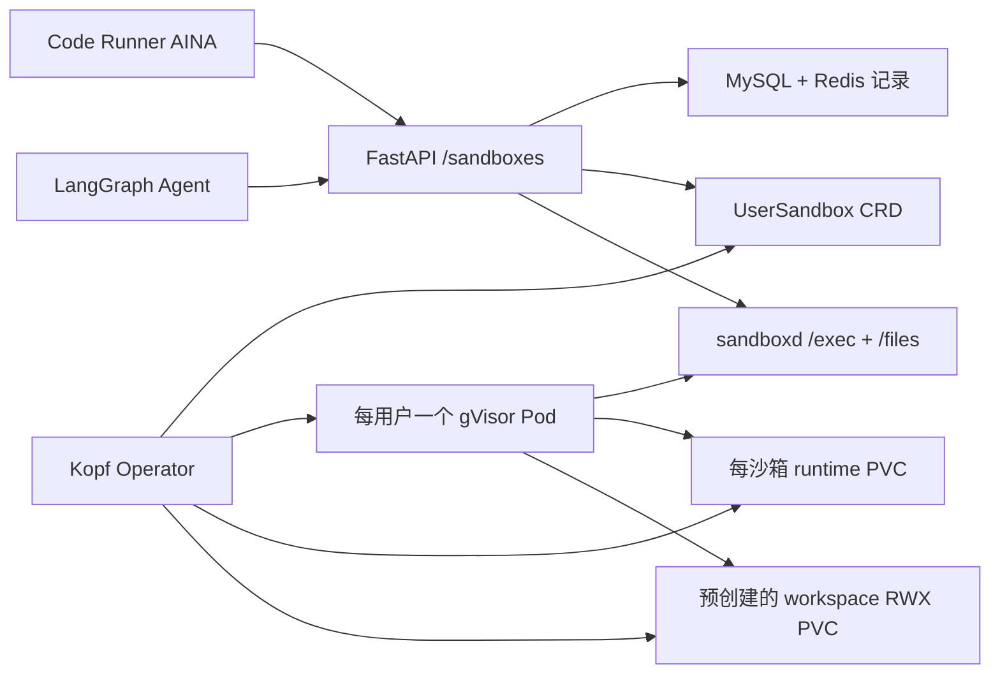

# 用户沙箱平台

## 目标

每个 standalone 对话或 workspace 拥有一个逻辑沙箱，可以执行 Python、Bash 与 Node.js
脚本，并把 `pip`/`npm` 用户级依赖保存在工作区。开发和生产使用相同的 API、镜像、
`UserSandbox` CRD、Kopf Operator 和 Helm Chart；环境差异只放在 values 文件中，
因此不需要迁移运行模型。

`local` 进程驱动仅用于 Windows 上不具备 K3s 的快速开发和确定性测试，不能承载不可信代码。
需要验证真实隔离时，本地也应使用单节点 K3s 和 `values-local.yaml`。

## 架构



主要不变量：

- 租户、用户与 workspace 身份映射为稳定的 Kubernetes 资源名；standalone 使用独立作用域。
- 多个 Unibot 后端节点通过 Redis 可续租分布式锁串行化同一沙箱作用域的初始化、执行、停止和重置。
- Pod 使用 `runsc` RuntimeClass、非 root 用户、只读根文件系统、禁用提权并删除全部 Linux capabilities。
- 运行镜像只能由平台环境变量配置，普通沙箱请求不能覆盖镜像。
- 每沙箱 runtime PVC 使用 `ReadWriteOncePod` 并由 `UserSandbox` ownerRef 管理。workspace 文件从预创建的共享
  PVC 以 `workspaces/<server-storage-key>/files` 安全 `subPath` 挂载；共享 PVC 不设置 ownerRef。
- NetworkPolicy 只允许 Unibot 后端访问 `sandboxd`；依赖下载只能访问公网地址和显式配置的额外 CIDR。
- 停止仅回收 Pod/Service。workspace reset 删除 CR、runtime PVC、沙箱记录和执行历史，但不删除共享 PVC
  中的 workspace 文件；standalone reset 仍删除其独立 PVC。
- `SandboxService` 对 local 与 Kubernetes driver 提供相同的执行、文件写入、读取和删除契约；业务能力不直接访问宿主机路径或 Kubernetes API。
- `sandboxd` 串行处理同一用户的执行和文件操作；`PUT/GET/DELETE /files/{relative_path}` 只允许访问工作区内文件，写入使用原子替换并限制单文件大小。
- 脚本执行超时会终止整个进程组，并限制返回输出大小。

## 镜像

在仓库根目录构建并推送两个镜像。生产环境必须使用不可变版本号或 digest：

```bash
docker build -t registry.example.com/unibot/sandboxd:0.1.0 sandbox/sandboxd
docker build -t registry.example.com/unibot/sandbox-operator:0.1.0 sandbox/operator
docker push registry.example.com/unibot/sandboxd:0.1.0
docker push registry.example.com/unibot/sandbox-operator:0.1.0
```

## 本地环境

在 Debian/Ubuntu Linux 主机或虚拟机中安装 Ansible，然后执行单节点 K3s + gVisor
配置：

```bash
ansible-playbook \
  -i deploy/ansible/inventory/local.yml \
  deploy/ansible/playbooks/k3s-sandbox.yml

helm upgrade --install unibot-sandbox deploy/helm/unibot-sandbox \
  --namespace unibot-sandboxes \
  --create-namespace \
  -f deploy/helm/unibot-sandbox/values-local.yaml \
  --set operator.image.repository=registry.example.com/unibot/sandbox-operator \
  --set operator.image.tag=0.1.0 \
  --set sandbox.image.repository=registry.example.com/unibot/sandboxd \
  --set sandbox.image.tag=0.1.0
```

后端应部署到 `unibot` namespace，ServiceAccount 名为 `unibot-backend`，Pod 标签包含
`app.kubernetes.io/name=unibot-backend`。设置：

```dotenv
UNIBOT_SANDBOX_DRIVER=kubernetes
UNIBOT_SANDBOX_KUBERNETES_NAMESPACE=unibot-sandboxes
UNIBOT_SANDBOX_RUNTIME_CLASS=gvisor
UNIBOT_SANDBOX_DEFAULT_IMAGE=registry.example.com/unibot/sandboxd:0.1.0
UNIBOT_SANDBOX_KUBERNETES_WORKSPACE_PVC=unibot-workspaces-rwx
```

`UNIBOT_SANDBOX_KUBERNETES_WORKSPACE_PVC` 指向 `unibot-sandboxes` namespace 中由存储管理员预创建的
RWX PVC。未配置时，workspace 沙箱请求明确返回 503，不会退回到随 CR 级联删除的 runtime PVC。
Operator 只读取并挂载该 claim，不创建、修改或为其添加 ownerRef。共享卷根目录必须允许 UID/GID 1000
创建 workspace 子目录；若存储后端不满足该权限模型，workspace Kubernetes 沙箱应保持禁用。

生产入口必须由认证网关提供可信的租户和用户身份；不要直接把匿名开发接口暴露到公网。

## 生产环境

生产仍安装同一个 Chart，只替换 inventory、镜像版本、存储类和容量：

```bash
ansible-playbook \
  -i deploy/ansible/inventory/production.yml \
  deploy/ansible/playbooks/k3s-sandbox.yml

helm upgrade --install unibot-sandbox deploy/helm/unibot-sandbox \
  --namespace unibot-sandboxes \
  --create-namespace \
  -f deploy/helm/unibot-sandbox/values-production.yaml \
  --set operator.image.repository=registry.example.com/unibot/sandbox-operator \
  --set operator.image.tag=0.1.0 \
  --set sandbox.image.repository=registry.example.com/unibot/sandboxd \
  --set sandbox.image.tag=0.1.0
```

Longhorn 提供多节点持久卷；MySQL/Redis 继续保存控制面记录。若使用企业内部依赖源，
把其 CIDR 加入 `networkPolicy.additionalEgressCidrs`。生产 inventory 中的集群 token
必须使用 Ansible Vault。

## 验证

```bash
kubectl get runtimeclass gvisor
kubectl auth can-i create usersandboxes.sandbox.unibot.ai \
  --as=system:serviceaccount:unibot:unibot-backend \
  -n unibot-sandboxes
kubectl get usersandboxes,pods,pvc -n unibot-sandboxes
```

打开 `/canvas/unibot-code-runner`，连续执行默认 Python 示例两次。计数应从 1 变为 2；
停止容器后再次执行，工作区计数仍继续增长；重置后计数重新从 1 开始。
