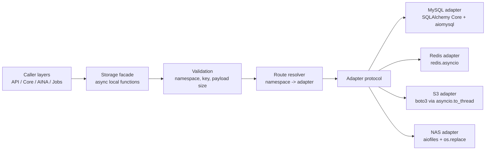
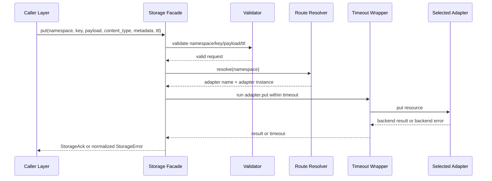

# Storage Layer Design

## Overview

The storage layer is a local backend module under `backend/src/tianzhou_agent_platform/store`. Upper application layers call it through typed asynchronous Python functions. It is not an HTTP, RPC, or standalone network service.

The layer provides a generic resource contract:

```text
namespace + key -> bytes payload + content type + metadata
```

Version tokens, compare-and-swap, public transaction boundaries, distributed locks, distributed consensus, filtering, joins, and secondary indexes are intentionally out of scope. The storage layer delegates distributed consistency, durability, replication, and availability to the configured production storage systems.

The first implementation provides concrete adapters for:

- MySQL, through SQLAlchemy Core async engine and the `mysql+aiomysql` driver.
- Redis, through `redis.asyncio`.
- S3-compatible object storage, through `boto3` calls wrapped with `asyncio.to_thread`.
- NAS/filesystem storage, through `aiofiles` plus Python standard-library filesystem commit operations.

Research references used for this design:

- [MySQL InnoDB autocommit, commit, and rollback](https://dev.mysql.com/doc/refman/8.4/en/innodb-autocommit-commit-rollback.html)
- [Redis EXPIRE and TTL behavior](https://redis.io/docs/latest/commands/expire/)
- [Amazon S3 strong consistency](https://aws.amazon.com/s3/consistency/)
- [Amazon S3 conditional writes](https://docs.aws.amazon.com/AmazonS3/latest/userguide/conditional-writes.html)
- [Python os.replace atomic rename behavior](https://docs.python.org/3/library/os.html#os.replace)
- [Python os.link hard-link creation](https://docs.python.org/3/library/os.html#os.link)

Dependency alignment with `backend/pyproject.toml`:

- MySQL uses `sqlalchemy` and `aiomysql`; do not introduce `asyncmy`.
- Redis uses `redis` and its `redis.asyncio` API.
- S3 uses `boto3`; do not introduce `aioboto3` for the first implementation.
- NAS/filesystem uses `aiofiles` for async file I/O and `os.replace` for atomic commit.
- Storage configuration uses `pydantic-settings` for environment-backed settings validation.

## Architecture

The storage layer has one public facade, a namespace route resolver, a shared adapter protocol, and four concrete adapters. Caller layers never instantiate backend-specific clients.



Storage operation flow:



Design decisions and rationales:

- Namespace-based routing keeps the public API small while allowing different storage backends for different resource families.
- Payloads are `bytes + content_type` because the generic contract must support JSON, binary files, serialized memory artifacts, and object payloads without type branching.
- `list` returns summaries instead of payloads to avoid accidentally loading large object bodies during discovery.
- MySQL is used as key-addressed durable storage for this generic contract. Structured tables, joins, and query repositories can be added later in business-specific repository modules.
- Distributed concerns remain delegated to MySQL, Redis, S3, and NAS because production storage systems already provide the required distributed behavior.
- Concurrent `put` uses last-writer-wins according to the selected backend adapter's commit order.
- TTL is supported only by adapters that can honor it correctly. The storage layer rejects TTL on adapters that do not support it instead of silently ignoring retention intent.
- S3 `create` uses provider-side conditional write support instead of a racy head-then-put check.
- NAS stores payload and metadata in one committed envelope file so single-operation atomicity does not depend on updating two files.

## Components And Interfaces

### Public Facade

The facade exposes async local functions:

```python
async def get(namespace: str, key: str, *, missing_ok: bool = False) -> StorageObject | None: ...

async def exists(namespace: str, key: str) -> bool: ...

async def create(
    namespace: str,
    key: str,
    payload: bytes,
    content_type: str,
    *,
    metadata: dict[str, str] | None = None,
    ttl: int | None = None,
) -> StorageAck: ...

async def put(
    namespace: str,
    key: str,
    payload: bytes,
    content_type: str,
    *,
    metadata: dict[str, str] | None = None,
    ttl: int | None = None,
) -> StorageAck: ...

async def delete(namespace: str, key: str, *, missing_ok: bool = False) -> StorageAck: ...

async def list(
    namespace: str,
    *,
    prefix: str | None = None,
    page_size: int | None = None,
    page_token: str | None = None,
) -> StoragePage: ...
```

Facade responsibilities:

- Validate namespace, key, content type, metadata, payload size, TTL, and page size.
- Resolve the namespace route to one adapter.
- Execute adapter operations under the configured timeout.
- Normalize adapter results into shared data models.
- Translate backend-specific failures into storage-layer errors.

### Route Resolver

Routing is configuration-driven:

```text
routes:
  memory: mysql
  cache: redis
  attachments: s3
  local_files: nas
default_adapter: mysql
```

Resolution rules:

- If a namespace has an explicit route, use that adapter.
- If no explicit route exists and `default_adapter` is configured, use the default adapter.
- If no explicit route and no default exist, raise `UnknownNamespaceError`.
- If a route references an unconfigured adapter, startup validation fails.

### Adapter Protocol

All adapters implement the same async protocol:

```python
class StorageAdapter(Protocol):
    name: str
    supports_ttl: bool
    supports_ordered_list: bool

    async def startup(self) -> None: ...
    async def shutdown(self) -> None: ...
    async def get(self, namespace: str, key: str) -> StorageObject | None: ...
    async def exists(self, namespace: str, key: str) -> bool: ...
    async def create(self, namespace: str, key: str, resource: StorageWrite) -> StorageAck: ...
    async def put(self, namespace: str, key: str, resource: StorageWrite) -> StorageAck: ...
    async def delete(self, namespace: str, key: str) -> bool: ...
    async def list(self, namespace: str, prefix: str | None, page_size: int, page_token: str | None) -> StoragePage: ...
```

### Concrete Adapters

MySQL adapter:

- Uses SQLAlchemy Core with an async engine created from a `mysql+aiomysql` URL.
- Stores generic resources in one table keyed by `(namespace, resource_key)`.
- Uses single SQL statements or short internal transactions per public storage operation.
- Does not expose public transaction or unit-of-work APIs.
- Does not support TTL in the first implementation.

Redis adapter:

- Uses `redis.asyncio`.
- Stores a compact binary envelope containing payload, content type, and metadata.
- Uses native Redis expiration for TTL.
- Does not guarantee ordered listing unless implemented with a sorted index; if no sorted index is configured, `list` raises `UnsupportedOperationError`.

S3 adapter:

- Uses `boto3` clients from the configured endpoint, bucket, and credentials.
- Wraps blocking `boto3` operations with `asyncio.to_thread` so the public storage facade remains async.
- Maps namespace/key to an object key with safe escaping.
- Stores content type using object content type.
- Stores metadata as object metadata where provider limits allow.
- Reserves the `tzap-` metadata prefix for storage-layer metadata and rejects caller metadata keys that use that prefix.
- Implements `create` with `PutObject` plus `IfNoneMatch="*"` when the configured S3-compatible provider supports conditional writes.
- Raises `UnsupportedOperationError` for `create` if the provider cannot atomically reject an existing object key.
- Maps S3 precondition failures from conditional create to `AlreadyExistsError`.
- Does not support TTL in the first implementation.
- Ordered list is lexicographic by object key when the S3-compatible provider supports ordered listing.

NAS/filesystem adapter:

- Uses `aiofiles` for async file reads and writes.
- Stores each resource as a single binary envelope file containing content type, metadata, and payload.
- Writes the complete envelope to a temporary file in the target directory before commit.
- Implements `put` by committing the temporary file with `os.replace`.
- Implements `create` by committing the completed temporary file with `os.link`, which fails if the target already exists.
- Raises `UnsupportedOperationError` for `create` if the filesystem or NAS mount does not support atomic hard-link creation.
- Does not support TTL in the first implementation.
- Lists by scanning namespace directory entries and sorting keys lexicographically.

## Data Models

### Public Models

```python
@dataclass(frozen=True)
class StorageObject:
    payload: bytes
    content_type: str
    metadata: dict[str, str]


@dataclass(frozen=True)
class StorageObjectSummary:
    key: str
    content_type: str
    metadata: dict[str, str]
    size: int | None


@dataclass(frozen=True)
class StoragePage:
    items: list[StorageObjectSummary]
    next_page_token: str | None


@dataclass(frozen=True)
class StorageAck:
    namespace: str
    key: str
    adapter: str
```

Internal write model:

```python
@dataclass(frozen=True)
class StorageWrite:
    payload: bytes
    content_type: str
    metadata: dict[str, str]
    ttl: int | None
```

Configuration model:

```python
class StorageSettings(BaseSettings):
    adapters: dict[str, AdapterSettings]
    routes: dict[str, str]
    default_adapter: str | None = None
    default_timeout_seconds: float = 5.0
    max_payload_bytes: int = 16 * 1024 * 1024
    default_page_size: int = 100
    max_page_size: int = 1000
```

Validation defaults:

- Namespace: lowercase letters, digits, `_`, `-`, `.`, maximum 128 characters.
- Key: non-empty, maximum 512 characters, no `/`, `\`, `..`, or control characters.
- Content type: ASCII MIME-style `type/subtype`, maximum 255 characters, no whitespace or control characters.
- Payload size: configurable, default 16 MiB.
- Operation timeout: configurable, default 5 seconds.
- Page size: configurable, default 100, maximum 1000.
- TTL: positive integer seconds.
- Metadata: string keys and string values only.
- Metadata keys: maximum 128 characters, ASCII lowercase letters, digits, `_`, `-`, `.`, no `tzap-` prefix.
- Metadata values: maximum 1024 characters, no control characters.

### MySQL Table

The generic resource table:

```sql
CREATE TABLE storage_resources (
    namespace VARCHAR(128) NOT NULL,
    resource_key VARCHAR(512) NOT NULL,
    payload LONGBLOB NOT NULL,
    content_type VARCHAR(255) NOT NULL,
    metadata JSON NOT NULL,
    created_at TIMESTAMP(6) NOT NULL DEFAULT CURRENT_TIMESTAMP(6),
    updated_at TIMESTAMP(6) NOT NULL DEFAULT CURRENT_TIMESTAMP(6) ON UPDATE CURRENT_TIMESTAMP(6),
    PRIMARY KEY (namespace, resource_key)
);
```

Notes:

- `create` maps to insert and fails on duplicate key.
- `put` maps to upsert or replace-by-primary-key behavior.
- `list` filters by namespace and optional key prefix, orders by `resource_key`, and pages by the last key token.
- TTL is rejected for MySQL in v1.

### Adapter Storage Shapes

Redis envelope:

```text
magic: "TZSTOR1"
header_length: 4-byte unsigned big-endian integer
header: UTF-8 JSON bytes containing content_type and metadata
payload: raw bytes payload
```

S3 object:

```text
bucket: configured per adapter
object key: escaped_namespace/escaped_key
content type: request content_type
metadata: request metadata plus internal namespace/key markers
body: raw bytes payload
```

NAS envelope file:

```text
root/
  namespace/
    escaped_key.bin

file format:
  magic: "TZSTOR1"
  header_length: 4-byte unsigned big-endian integer
  header: UTF-8 JSON bytes containing content_type and metadata
  payload: raw bytes payload
```

## Error Handling

Error hierarchy:

```python
class StorageError(Exception): ...
class StorageConfigurationError(StorageError): ...
class UnknownNamespaceError(StorageError): ...
class InvalidNamespaceError(StorageError): ...
class InvalidKeyError(StorageError): ...
class InvalidContentTypeError(StorageError): ...
class NotFoundError(StorageError): ...
class AlreadyExistsError(StorageError): ...
class UnsupportedOperationError(StorageError): ...
class AdapterUnavailableError(StorageError): ...
class StorageTimeoutError(StorageError): ...
class PayloadTooLargeError(StorageError): ...
class StorageBackendError(StorageError): ...
```

Policy:

- Translate backend-specific exceptions before returning to caller layers.
- Do not expose secrets, raw connection strings, credentials, or raw backend exception payloads.
- `get(..., missing_ok=False)` raises `NotFoundError`; `get(..., missing_ok=True)` returns `None`.
- `delete(..., missing_ok=False)` raises `NotFoundError`; `delete(..., missing_ok=True)` returns `StorageAck`.
- `create` on an existing key raises `AlreadyExistsError`.
- TTL on adapters without TTL support raises `UnsupportedOperationError`.
- TTL values are positive integer seconds.
- Invalid namespace/key fails before route resolution reaches a backend client.
- Invalid content type or metadata fails before route resolution reaches a backend client.
- Timeout wrapper raises `StorageTimeoutError` with operation name, namespace, adapter, and retryability.
- Backend unavailable errors are normalized to `AdapterUnavailableError`.
- Other backend failures are normalized to `StorageBackendError`.

## Testing Strategy

Unit tests:

- Validate namespace and key rules.
- Validate content type and metadata rules.
- Validate payload size limit and metadata type handling.
- Validate default page size, max page size, and TTL unit handling.
- Validate namespace route resolution, default adapter selection, and unknown namespace errors.
- Validate startup configuration checks for missing adapters and invalid routes.
- Validate timeout wrapper behavior.
- Validate backend error translation.

Shared adapter contract tests:

- `create` then `get` returns identical payload, content type, and metadata.
- `create` on duplicate key raises `AlreadyExistsError`.
- `exists` reflects created and deleted resources.
- `put` creates or replaces a full resource.
- `delete` removes existing resources.
- `missing_ok` behavior for `get` and `delete`.
- `list` returns lexicographic key order where the adapter supports ordered listing.
- Pagination returns a next token and continues from the expected key.
- Unsupported TTL raises `UnsupportedOperationError`.
- Binary payloads round-trip byte for byte.
- `create` atomically rejects existing keys or raises `UnsupportedOperationError` when the adapter cannot provide that behavior.

Concrete adapter tests:

- MySQL tests run only when MySQL connection environment variables are configured.
- Redis tests run only when Redis connection environment variables are configured.
- S3 tests run only when S3 endpoint, bucket, and credentials are configured.
- NAS tests use a temporary local directory and do not require external services.
- S3 `create` tests verify conditional writes map existing-object precondition failures to `AlreadyExistsError`.
- NAS tests verify `create` does not overwrite an existing envelope and that no partial resource is visible after a failed write.

Acceptance scenarios:

- Caller layers can use the facade without importing backend clients.
- Namespaces route to MySQL, Redis, S3, or NAS according to configuration.
- Redis TTL expires resources.
- MySQL rejects TTL.
- S3 and NAS preserve binary payloads and content type.
- Concurrent `put` on the same namespace/key follows last-writer-wins semantics.
- Logs include operation name, namespace, adapter, duration, and error category without payload contents.
